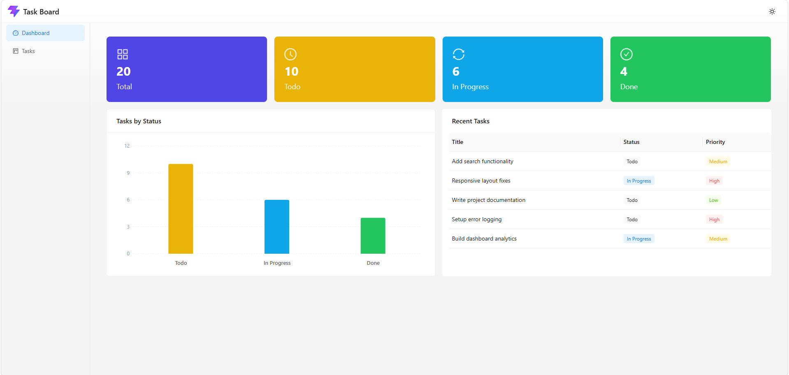
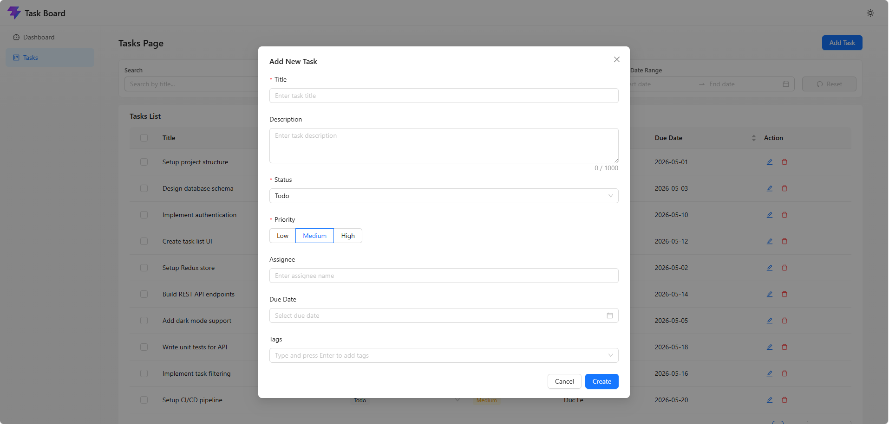
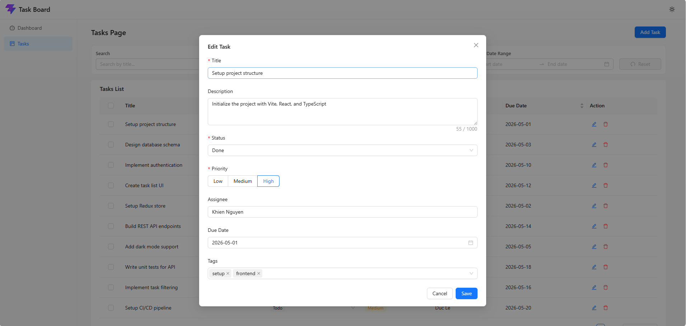
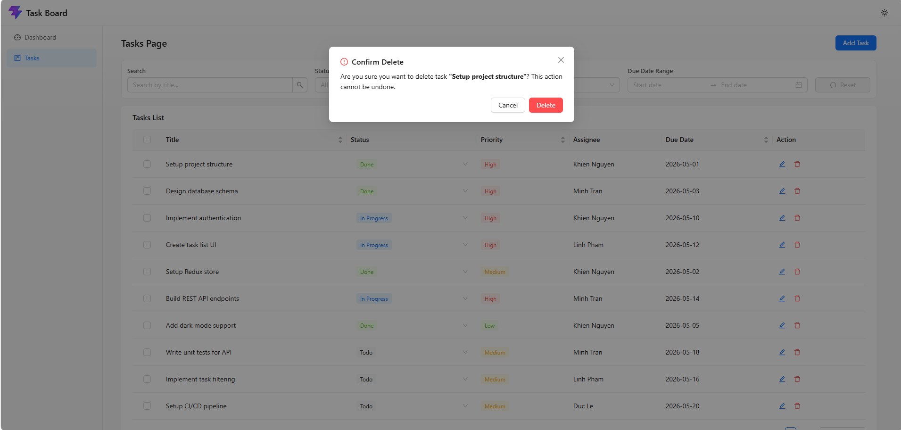
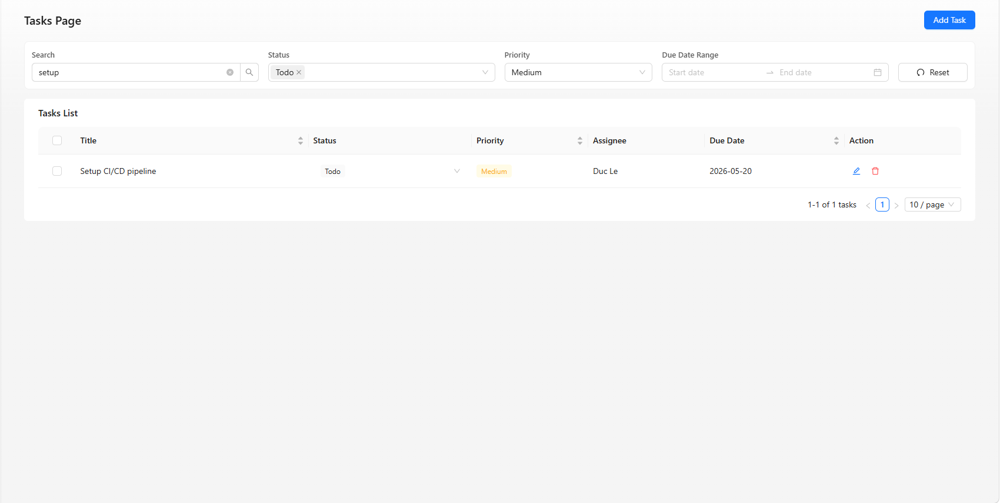
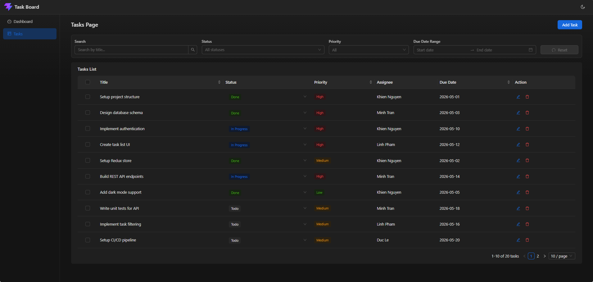

# Task Board — Admin Dashboard

Ứng dụng quản lý công việc dạng dashboard, xây dựng bằng React, TypeScript và Ant Design.

**Live Demo:** [https://taskboard-iota-hazel.vercel.app](https://taskboard-iota-hazel.vercel.app)

## Công nghệ sử dụng

### Yêu cầu

| Công nghệ | Phiên bản | Mục đích |
|---|---|---|
| React | 18 | Framework |
| TypeScript | 5 | Ngôn ngữ |
| Vite | 8 | Build tool |
| Redux Toolkit | 2.x | Quản lý state |
| Ant Design | 5.x | Thư viện UI component |
| Tailwind CSS | 3.x | Framework UI |

### Một số thư viện khác

| Công nghệ | Phiên bản | Lý do |
|---|---|---|
| ProComponents | 2.8 | Thư viện UI component |
| Recharts | 3.8 | Thư viện vẽ biểu đồ |
| nuqs | 2.8 | Thư viện đồng bộ state với URL |

## Cài đặt & Chạy

```bash
# Clone dự án
git clone https://github.com/waynekhien/fe-test-nguyen-gia-khien.git
cd fe-test-nguyen-gia-khien

# Cài đặt dependencies
yarn install

# Chạy dev server
yarn dev

# Build production
yarn build

```

## Tính năng

### Dashboard
- Thẻ thống kê: Total, Todo, In Progress, Done
- Biểu đồ bar chart theo trạng thái (Recharts)
- Bảng 5 task gần đây nhất



### Quản lý Task (CRUD)
- Thêm / Sửa task 
- Xoá task với modal xác nhận
- Xoá nhiều task
- Đổi trạng thái trực tiếp bằng Select inline trong bảng
- Thông báo thành công / lỗi cho mọi thao tác

| Thêm Task | Sửa Task | Xoá Task |
|---|---|---|
|  |  |  |

### Lọc & Tìm kiếm
- Tìm kiếm theo tiêu đề (debounce 300ms)
- Lọc theo trạng thái (multi-select), độ ưu tiên, khoảng hạn chót
- Nút Reset xoá toàn bộ bộ lọc



### Sắp xếp
- Sort theo Tiêu đề, Độ ưu tiên, Hạn chót

### Phân trang
- Tuỳ chọn 10 / 20 / 50 dòng mỗi trang

### Đồng bộ URL (nuqs)
- Filter và sort được lưu trên URL query params
- Chia sẻ link, refresh trang giữ nguyên trạng thái

### Giao diện
- Light / Dark mode
- Quản lý theme qua Redux, Ant Design tokens tự thích ứng



### Responsive
- Sidebar thu gọn trên mobile
- Filter bar responsive (Row/Col grid)
- Bảng cuộn ngang trên màn hình nhỏ
